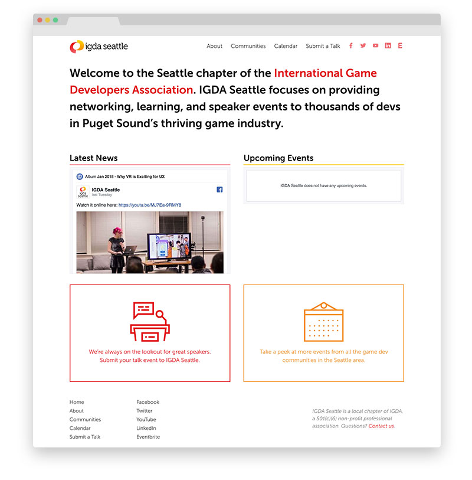

# IGDA Seattle Website

This website was designed and built by [Constance Chen](https://www.constancechen.me) for IGDA Seattle, a local professional chapter for game developers in the Seattle area.

## Making Changes

### Requirements
- [Install Jekyll](https://jekyllrb.com/docs/installation/) and all it's requirements (Ruby, etc.)
  - `bundle install` within this dir
- [Install Node](https://nodejs.org/)
  - `npm install` within this dir

### Developing
- `gulp`
- Open up a tab to `http://localhost:4000`
- Note:
  - **Don't** edit anything within the non `_`-prefixed distribution folders (e.g. `assets`, `dist`).
  - **Do** edit templates/source files within `_`-prefixed folders.

### Deploying
- `git commit`
- `git push` to master
- GitHub Pages handles the rest!
